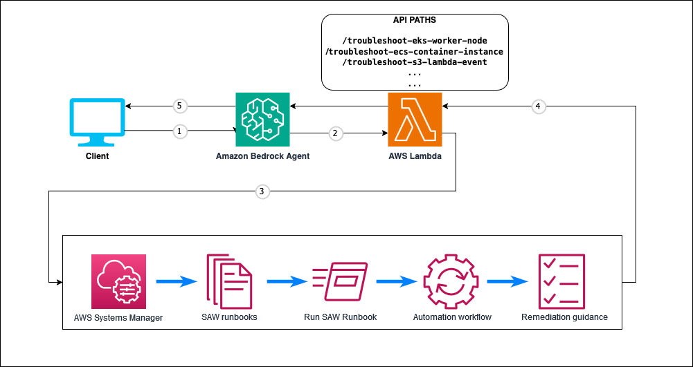

# Amazon Bedrock Agent for AWS Support Automation Workflow (SAW)

## Overview

This application deploys an Amazon Bedrock agent that provides a natural language interface to AWS Support Automation Workflow (SAW) documents. AWS Support Automation Workflow is a collection of curated AWS Systems Manager (SSM) self-service automation runbooks created by AWS Support Engineering with best practices learned from solving customer issues. These runbooks enable AWS customers to troubleshoot, diagnose, and remediate common issues with their AWS resources without needing to contact AWS Support.

The agent currently supports the following troubleshooting scenarios as examples, with the framework designed to be extended to support many more SAW documents:

1. Amazon EKS worker nodes failing to join a cluster
2. Amazon ECS container instances failing to register with a cluster
3. Amazon S3 event notifications failing to trigger Lambda functions

## Architecture



The solution consists of the following components:

1. **Amazon Bedrock Agent**: Provides the natural language interface for users to interact with
2. **AWS Lambda Function**: Executes the troubleshooting logic by invoking AWS Support Automation Workflow documents
3. **AWS Systems Manager Automation Documents**: Curated runbooks from AWS Support Engineering that perform the actual troubleshooting tasks
4. **IAM Role**: Provides the necessary permissions for the Lambda function to execute the automation documents

## AWS Support Automation Workflow (SAW) Documents

AWS Support Automation Workflow (SAW) documents are specialized AWS Systems Manager (SSM) Automation documents created by AWS Support Engineering. These documents encapsulate AWS Support's best practices for troubleshooting common issues and are available to all AWS customers at no additional cost.

Key benefits of using SAW documents:
- Implement AWS Support's recommended troubleshooting methodology
- Automate complex diagnostic procedures that would otherwise require manual investigation
- Provide detailed, actionable insights about resource misconfigurations
- Reduce time to resolution for common AWS service issues

The framework is designed to be easily extended to support additional SAW documents as they become available or as your specific use cases require. AWS Support regularly releases new SAW documents to address common customer issues across various AWS services.

For more information about AWS Support Automation Workflow documents, visit the [AWS Systems Manager User Guide](https://docs.aws.amazon.com/systems-manager/latest/userguide/automation-documents-reference.html).

## Folder Structure

The application codebase is organized into the following folders:

```
bedrock-agent-saw
│
├── bin
│   └── bedrock-agent-saw.ts                  # CDK app entry point
├── lib                                       # CDK Stacks
│   └── bedrock-agent-saw-stack.ts            # Stack deploying the Bedrock Agent and Action Group 
├── lambda                                    # Lambda functions
│   └── saw_troubleshooting                   # Action Group functions
│       ├── app.py                            # Main Lambda handler and API endpoints
│       └── utils.py                          # Utility functions for SSM Automation
├── bedrock_agent_schemas                     # OpenAPI schema for the Bedrock Agent
│   └── schema.json                           # Auto-generated schema for the agent
```

**Note**: The `schema.json` file is generated automatically by using [Powertools for AWS Lambda](https://docs.powertools.aws.dev/lambda/python/latest/core/event_handler/bedrock_agents/). Below are the commands to generate the file:

```shell
pip3 install boto3 aws-lambda-powertools pydantic==1.* typing-extensions
python3 lambda/saw_troubleshooting/app.py > bedrock_agent_schemas/schema.json
```

## Getting Started

### Prerequisites

- An AWS account
- [AWS CLI](https://aws.amazon.com/cli/): configured with appropriate credentials
- Node.js: v18.12.1 or later
- [AWS CDK](https://github.com/aws/aws-cdk/releases/tag/v2.143.0): 2.143.0 or later
- Python 3.9 or later (for local development)

### Deploy the Solution

1. Clone this repository:
   ```bash
   git clone https://github.com/aws-samples/bedrock-agent-saw.git
   cd bedrock-agent-saw
   ```

2. Install dependencies:
   ```bash
   npm install
   ```

3. Bootstrap AWS CDK resources (if not already done):
   ```bash
   cdk bootstrap aws://ACCOUNT_ID/REGION
   ```

4. Enable access to Amazon Bedrock models:
   - Follow instructions in the [Amazon Bedrock User Guide](https://docs.aws.amazon.com/bedrock/latest/userguide/model-access.html) to enable access to the Claude model.
   - Ensure you have enabled access to the Anthropic Claude 3.5 Sonnet model in your AWS account.

5. Deploy the application:
   ```bash
   cdk deploy
   ```

6. Note the AgentId output from the CDK deployment, which you'll need to access your agent.

### Testing the Agent

1. Navigate to the [Amazon Bedrock Agents console](https://console.aws.amazon.com/bedrock/home#/agents) in your AWS region.
2. Find your agent using the AgentId from the CDK output.
3. Select the agent and click on "Test" in the left navigation panel.
4. In the test window, you can interact with your agent using natural language.

#### Example Questions and Conversation Flow

**Example 1: EKS Worker Node Troubleshooting**
```
User: "I want to troubleshoot why my EKS worker node is not joining the cluster. Can you help me?"

Agent: "I'd be happy to help you troubleshoot why your EKS worker node isn't joining the cluster. I'll use the AWS Support Automation Workflow document specifically designed for this issue.

To proceed, I'll need the following information:
1. What's the name of your EKS cluster?
2. What's the EC2 instance ID of the worker node that's failing to join?

Once you provide these details, I can run the troubleshooting automation."

User: "My cluster name is 'production-cluster' and the worker node ID is 'i-0abc123def456789'"

Agent: [Runs troubleshooting and provides detailed analysis with remediation steps]
```

**Example 2: S3 Event Notification Troubleshooting**
```
User: "I need to troubleshoot why my S3 bucket is not triggering my Lambda function. The bucket name is 'my-test-bucket' and the Lambda ARN is 'arn:aws:lambda:us-east-1:123456789012:function:my-function'."

Agent: [Runs troubleshooting and provides detailed analysis with remediation steps]
```

### Understanding the Results

The agent will provide:

1. A summary of the issues found
2. Detailed explanation of each problem
3. Specific remediation steps to resolve the issues
4. Links to relevant AWS documentation when applicable

## Extending the Solution

This solution can be extended to support additional AWS Support Automation Workflow documents by:

1. Adding new API endpoints in the Lambda function (`lambda/saw_troubleshooting/app.py`)
2. Updating the IAM permissions in the CDK stack as needed
3. Regenerating the OpenAPI schema

### Example: Adding a New SAW Document

To add support for a new SAW document (e.g., AWSSupport-TroubleshootRDSConnectivity):

1. Add a new endpoint in `app.py`:
   ```python
   @app.post("/troubleshoot-rds-connectivity", description="Troubleshoot RDS connectivity issues")
   @tracer.capture_method
   def troubleshoot_rds_connectivity(
       db_instance_id: str = Body(description="The ID of the RDS instance"),
       source_instance_id: str = Body(description="The ID of the instance trying to connect")
   ) -> Annotated[dict, Body(description="The output of the Automation execution")]:
       return execute_automation(
           'AWSSupport-TroubleshootRDSConnectivity',
           {'DBInstanceId': [db_instance_id], 'SourceInstanceId': [source_instance_id]},
           'GenerateReport'
       )
   ```

2. Update IAM permissions in `bedrock-agent-saw-stack.ts` if needed
3. Regenerate the schema:
   ```bash
   python3 lambda/saw_troubleshooting/app.py > bedrock_agent_schemas/schema.json
   ```
4. Redeploy the solution:
   ```bash
   cdk deploy
   ```

## Monitoring and Troubleshooting

### CloudWatch Logs

The solution uses AWS Lambda Powertools for structured logging. To view logs:

1. Navigate to the [CloudWatch Logs console](https://console.aws.amazon.com/cloudwatch/home#logsV2:log-groups)
2. Find the log group named `/aws/lambda/BedrockAgentSawStack-ActionGroupFunction*`
3. Search for specific execution IDs or error messages

### Common Issues and Solutions

1. **Agent fails to execute automation**:
   - Check IAM permissions for the Lambda execution role
   - Verify that the SAW document exists in your account
   - Ensure parameters are correctly formatted

2. **Deployment failures**:
   - Ensure you have enabled access to the required Bedrock model
   - Check CDK bootstrap status in your account
   - Verify AWS CLI credentials have sufficient permissions

3. **Agent not responding as expected**:
   - Regenerate the OpenAPI schema to ensure it's up to date
   - Check CloudWatch Logs for any errors in the Lambda function
   - Verify the agent is properly configured in the Bedrock console

## Security

This solution follows AWS security best practices:

- Uses CDK Nag to validate infrastructure against security best practices
- Implements least privilege IAM permissions where possible
- Leverages AWS Lambda Powertools for secure logging and tracing

See [CONTRIBUTING](CONTRIBUTING.md#security-issue-notifications) for more information on reporting potential security issues.

## Clean Up

To avoid unexpected charges, delete the stack when you're done:

```bash
cdk destroy
```

## Cost Considerations

This solution uses several AWS services that may incur costs in your AWS account:

| Service | Usage | Cost Factors |
|---------|-------|--------------|
| Amazon Bedrock | Agent and model usage | Number of API calls, tokens processed |
| AWS Lambda | Function invocations | Number of invocations, duration, memory |
| AWS Systems Manager | Automation document executions | Number of automation steps executed |
| Amazon CloudWatch | Logs and metrics | Log storage, metric data points |

For current pricing information, refer to:
- [Amazon Bedrock Pricing](https://aws.amazon.com/bedrock/pricing/)
- [AWS Lambda Pricing](https://aws.amazon.com/lambda/pricing/)
- [AWS Systems Manager Pricing](https://aws.amazon.com/systems-manager/pricing/)
- [Amazon CloudWatch Pricing](https://aws.amazon.com/cloudwatch/pricing/)

For a detailed cost estimate based on your expected usage, use the [AWS Pricing Calculator](https://calculator.aws).

## License

This library is licensed under the MIT-0 License. See the LICENSE file.

## Contributing

We welcome contributions! See [CONTRIBUTING](CONTRIBUTING.md) for more information.

## Content Security Legal Disclaimer

The sample code; software libraries; command line tools; proofs of concept; templates; or other related technology (including any of the foregoing that are provided by our personnel) is provided to you as AWS Content under the AWS Customer Agreement, or the relevant written agreement between you and AWS (whichever applies). You should not use this AWS Content in your production accounts, or on production or other critical data. You are responsible for testing, securing, and optimizing the AWS Content, such as sample code, as appropriate for production grade use based on your specific quality control practices and standards. Deploying AWS Content may incur AWS charges for creating or using AWS chargeable resources, such as running Amazon EC2 instances or using Amazon S3 storage.
